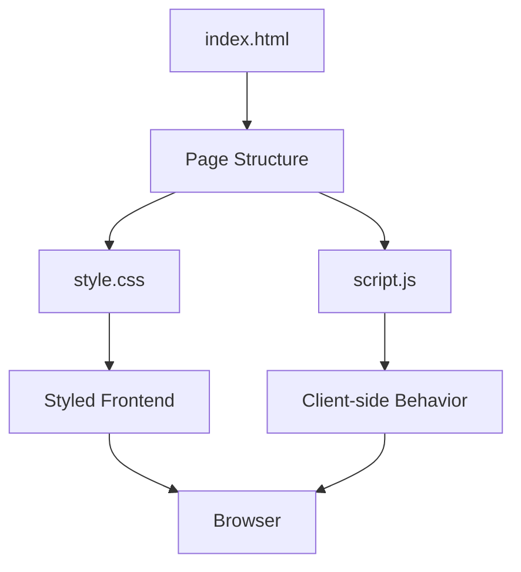

# CodeAlpha Frontend Development Task

A frontend development project completed as part of the **CodeAlpha Internship / Frontend Development Task**.

The project is implemented using standard web technologies and is organized into separate HTML, CSS, and JavaScript files.

---

## 📌 Project Overview

This repository contains the frontend implementation developed for a CodeAlpha task.

The project follows a simple and maintainable frontend structure:

- `index.html` — page structure and content
- `style.css` — styling and visual presentation
- `script.js` — client-side JavaScript functionality

The implementation is built without a backend dependency in the repository structure shown here.

---

## 🎯 Objective

The objective of this task is to demonstrate practical frontend development skills using:

- HTML
- CSS
- JavaScript

The project separates structure, presentation, and client-side behavior into dedicated files.

---

## 🛠️ Technologies Used

| Technology | Purpose |
|---|---|
| HTML5 | Web page structure |
| CSS3 | Styling and layout |
| JavaScript | Client-side interactions |

---

## 📁 Project Structure

```text
CodeAlpha-Frontend-Task/
│
├── index.html
├── style.css
├── script.js
└── README.md
```

---

## 🔄 Frontend Architecture



---

## 🚀 How to Run

### Option 1 — Open directly

Open `index.html` in a modern web browser.

### Option 2 — Run with VS Code Live Server

1. Open the repository in VS Code.
2. Install/use the **Live Server** extension.
3. Right-click `index.html`.
4. Select **Open with Live Server**.

---

## 🧩 Development Workflow

```text
HTML Structure
      ↓
CSS Styling
      ↓
JavaScript Functionality
      ↓
Browser Testing
      ↓
Frontend Task Completion
```

---

## 🧪 Testing Checklist

Before publishing the project, verify:

- [ ] `index.html` loads correctly
- [ ] CSS styles are applied correctly
- [ ] JavaScript loads without console errors
- [ ] Interactive elements behave as intended
- [ ] Layout works correctly in the browser
- [ ] The project works on different screen sizes where applicable

---

## 📚 Skills Demonstrated

This project demonstrates practical experience with:

- Semantic HTML structure
- CSS-based webpage styling
- Frontend file organization
- JavaScript integration
- Client-side web development
- Browser-based testing and debugging

---

## 🏢 CodeAlpha Internship

**Platform:** CodeAlpha

**Task Area:** Frontend Development

This repository contains the frontend task implementation completed as part of the CodeAlpha internship work.

---

## 👩‍💻 Author

**Sreehitha Keerthipati**

Computer Science Student  
KITS

- LinkedIn: https://www.linkedin.com/in/keerthipati-sreehitha/
- Email: sreehithak625@gmail.com

---

## ⭐ Repository Note

This README intentionally documents only the technologies and repository structure confirmed for this project. Specific application features can be added after reviewing the implementation in `index.html`, `style.css`, and `script.js`.
